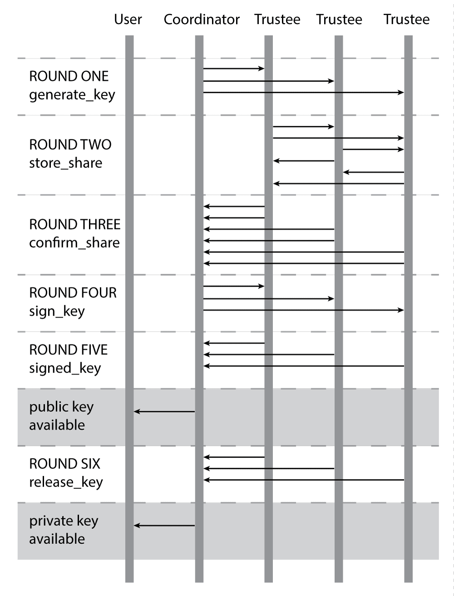

Network Time Travel Protocol
============================

## Introduction

Network Time Travel Protocol (NTTP) is a network service allowing messages to be encrypted so they cannot be decrypted until a certain amount of time has passed.

The system depends on a group of trusted keyholders, known as `Trustees`, who generate and publish public and private keys according to a fixed schedule. 

To **encrypt** a message, a user queries the NTTP server for a date in the future. The server returns the closest available public key along with a `release date` -- the date the corresponding private key will be available. If the release date is acceptable, the user encrypts the message with the public key. The user can and should verify that the key has been signed by the proper Trustees.
 
To **decrypt** a message, a user queries the NTTP server for a date in the past, or for a key fingerprint. Private keys are available only after the release date.

The Trustees generate and share keys using verifiable threshold secret sharing, so the private key *cannot* be published prior to the release date without compromising a given threshold of Trustees. Likewise, the private key *will* be recoverable after the release date as long as the threshold number of Trustees remain uncompromised.

## Cryptographic theory

NTTP implements the cryptographic protocol described in [M. O. Rabin and C. Thorpe. Time-lapse cryptography. Technical Report TR-22-06, Harvard University School of Engineering and Computer Science, 2006.](http://www.eecs.harvard.edu/~cat/tlc.pdf) In short, the protocol uses Pedersen distributed key generation to generate and publish ElGamal keypairs according to a fixed schedule.

Any implementation differences from the Rabin & Thorpe paper should be noted below.

## Implementation philosophy

This first version of NTTP is designed to be simple and secure, at the expense of automation and availability:

* Private key material is kept only on offline servers. Each round of key generation and release requires human operators to migrate and process data manually. 
* Key generation fails in the presence of improper Trustees (unlike Pedersen/Rabin & Thorpe, where key generation can continue with the subset of proper parties). If a Trustee fails to follow the protocol, key generation noisily fails until the problem is corrected manually.
* Non-sensitive processing is handled by a single front-end server, rather than through a distributed consensus algorithm.

## Definitions

### Parties

The `Trustees` are a group of legally, geographically, and technically distinct institutions around the world. To start with, the Trustees are likely to be a consortium of academic institutions.

The `Coordinator` initiates key generation and provides user access to generated keys. The Coordinator has no special access to key material.

### Servers

The `Coordination Server` is operated by the Coordinator.

Each Trustee operates three servers:

- The `Trustee Offline Server` is an airgapped computer where the Trustee stores key material and processes incoming and outgoing messages dealing with distributed key generation.

- The `Trustee Inbox Server` receives incoming messages from the Coordinator or other Trustees and, if they have valid signatures, stores them for offline processing.

- The `Trustee Outbox Server` stores offline messages from the Offline Server, sending them to the Coordinator or other Trustees at the appropriate time.

### Identity keys

The Coordinator is identified by a `Coordinator private key` stored on the Coordination Server. Compromise of the Coordinator's private key does not affect the security of the system.

The Trustees are each identified by a `Trustee private key` stored on the Offline Server. Compromise of a Trustee's private key renders the Trustee improper.

Other than these identity keys, all "keys" referred to in this document are distributed keys intended for time-based encryption.

### Magic numbers

The Trustees share a set of predefined, public constants:

`p` is a 4096-bit "safe" prime generated by `openssl dhparam -out dh4096.pem 4096`.

`q` is the prime equal to `(p-1)/2`.

`g` is a generator of prime order `q`. In practice, `g` is the smallest value passing the tests in [PyCrypto's ElGamal key generation function](https://github.com/dlitz/pycrypto/blob/master/lib/Crypto/PublicKey/ElGamal.py#L161).

The `recovery_threshold` is the number of Trustees who must participate in order to recover a given key.

## Message passing

Each of the Trustees maintains a Trustee Inbox Server that listens for messages from the Coordination Server and from other Trustees.

Once per week, each Trustee:

1. Copies the incoming messages from the Inbox Server to the Offline Server.
2. Confirms that the time on the Offline Server is correct.
3. Runs a message processing script on the Offline Server.
4. Copies outgoing messages from the Offline Server to the Outbox Server.

Outgoing messages may be pre-dated, meaning they are marked to be sent by the Outbox Server at some point during the following week.

This design means:

* Compromising the Inbox Server reveals no secret information to an attacker.
* Compromising the Outbox Servers, at best, allows an attacker to decrypt messages one week early.

The Outbox Server is kept separate from the Inbox Server so that it can be configured to reject all incoming traffic.

## Key generation protocol

Keys are generated and published through a series of messages sent between the Coordination Server and the Trustees.

This diagram shows the flow of messages for a simple network with three Trustees:

The steps shown in the diagram are as follows:

### Round One: `generate_key`

In Round One, the Coordination Server sends a message to each of the Trustees to trigger the generation of a new key, with a given release date and UUID.

- Message: `generate_key`
- From: Coordination Server
- To: Trustees
- Key_id: [uuid]
- Values (encrypted):
    - release_date: The date on which the generated private key should be published.

### Round Two: `store_share`

In Round Two, prompted by receiving a `generate_key` message, each Trustee generates its portion of an ElGamal key, and sends private shares and commitments to the other Trustees so they can verify that the key is recoverable.

Internally, the Offline Server generates and stores the following values:

- `x`: Private ElGamal key in the range `2 <= x <= q-1`
- `y`: Public ElGamel key equal to `g^x % p`
- `recovery_polynomial`: A polynomial for Shamir secret sharing of `x`, in the form `x + randint(q-1) * i + ... + randint(q-1) * i ^ (recovery_threshold-1)`
- `recovery_shares`: One secret share for each other Trustee, in the form `{share_input: j, share_output: recovery_polynomial(j)}` for j in 1..trustee_count
- `commitments`: A list of commitments the other Trustees can use to verify that they have received valid recovery_shares, in the form `g^coefficient % p` for each coefficient of the recovery_polynomial
- `share_recipients`: A mapping of which other Trustee will be sent each recovery_share

The Offline Server then sends a `store_share` message to each other Trustee:

- Message: `store_share`
- From: [each trustee]
- To: [each other trustee]
- Key_id: [uuid]
- Values (encrypted):
    - share_input: j
    - share_output: recovery_polynomial(j)
    - group_message:
        - p: p
        - g: g
        - release_date: release_date
        - y_share: y
        - commitments: commitments
        - share_recipients: share_recipients
        
### Round Three: `confirm_share`

In Round Three, prompted by receiving a `store_share` message, each Recipient Trustee confirms that it has received a valid share from the Sending Trustee.

Internally, the Recipient Trustee's Offline Server checks the following in the `store_share` message:

- The Recipient Trustee received the correct share: the share_input matches the value in share_recipients.
- The share_output matches the commitments: `g^share_output % p` is equal to the product of `commitment ^ share_input ^ i` for all commitments.

If these two checks pass, then the Recipient Trustee publicly announces that it has received a valid share from the Sending Trustee:

- Message: `confirm_share`
- From: Recipient Trustee
- To: Coordination Server
- Key_id: [uuid]
- Values (unencrypted):
    - server_id: The Sending Trustee's ID.
    - y_share: store_share -> group_message -> y_share
    - share_input: store_share -> share_input
    - is_valid: Whether the share passed the Recipient Trustee's checks.
    - message_hash: A cryptographic hash of the group_message.
    
### Round Four: `sign_key`

In Round Four, the Coordination Server generates a GPG public key, using the `confirm_share` messages, and sends it to the Trustees for signing.

The Coordination Server first waits until it has received all of the necessary `confirm_share` messages. There should be `trustee_count * (trustee_count-1)` messages.

The Coordination Server then confirms that:

- Each Trustee reported receiving a valid share from each other Trustee.
- The message_hash and y_share for each Sending Trustee matched among all Receiving Trustees.
- Each Receiving Trustee for a given Sending Trustee received a different share_input.
 
If all of these checks pass, the Coordination Server generates a new GPG keypair, consisting of:

- A randomly generated DSA signing key.
- An ElGamal subkey, with a dummy `x` value and a `y` value equal to the product of the y_shares received from each Sending Trustee.
- Metadata indicating the release_date for the key, the recovery_threshold, and the Trustees who must sign it for it to be valid.

The Coordination Server then sends this new GPG key to the Trustees for signing:

- Message: `sign_key`
- From: Coordination Server
- To: [each trustee]
- Key_id: [uuid]
- Values (encrypted):
    - confirmations: List of all confirm_share messages
    - public_key: The newly generated public key
    - private_key: The newly generated private key (for backup)

### Round Five: `signed_key`

In Round Five, prompted by a `sign_key` message, each Trustee checks the list of confirmations and calculates a y value using the same process as the Coordination Server in Round Four.

If the confirmations are valid, and the y value matches the value in the public_key provided by the Coordination Server, and the public_key metadata matches the Trustee's internal records, the Trustee signs the key and returns it:

- Message: `signed_key`
- From: Trustee
- To: Coordination Server
- Key_id: [uuid]
- Values (unencrypted):
    - public_key: Signed public key.
    
### Publication of public key

At this point, the Coordination Server should have received a `signed_key` message from each Trustee that was originally sent a `generate_key` message. This indicates that each Trustee agrees that the private key will be recoverable, on the release_date indicated in the key's metadata, as long as the threshold number of Trustees remains uncompromised.

The Coordination Server may now publish the public key in response to user requests, along with the signatures from each Trustee. Any user downloading the key may verify its validity by confirming that it is signed by each of the Trustees listed in its metadata.

### Round Six: `release_key`

In Round Six, the Trustee Offline Servers discover that they possess a key whose release_date has arrived. They each send a message to the Coordination Server releasing their share of the private key:
 
- Message: `release_key`
- From: [each trustee]
- To: Coordination Server
- Key_id: [uuid]
- Values (unencrypted):
    - x_share: x value generated during Round Two.
    - recovery_shares: A tuple of `(trustee_id, share_input, share_output)` for each recovery share known to this Trustee.
    
### Publication of private key

As soon as the Coordination Server receives at least recovery_threshold release_key messages, it attempts to recover the private key. Recovery is attempted using every viable combination of x_shares and recovery_shares, so the private key will be recovered as soon as enough valid release_key messages are received.

The Coordination Server then edits the GPG private key generated in Round Four to replace the dummy `x` value with the reconstructed private key, and publishes the private key to any user who requests it.

## Security Guarantees and Assumptions

This system makes the following assumptions:

- An encrypted message sent to a Trustee cannot be read without the Trustee's private key, which is stored only on the Offline Server or equally secure backup.
- Messages sent to a Trustee cannot subvert (e.g. buffer overflow) the Offline Computer, causing it to exfiltrate or delete data.

Assuming those are true:

- As long as the threshold number of Trustees do not voluntarily release the private key early, and do not have the Offline Server stolen or seized, messages encrypted with the public key cannot be released prior to the release_date.
- As long as the threshold number of Trustees preserve the data on the Offline Server, and release it on schedule, messages encrypted with the public key can be released at any time after the release date.
- An attacker who subverts the Coordination Server or the Trustee Inbox Servers cannot access encrypted messages early. Such an attacker can, however, temporarily delay the generation of new public or private keys.
- An attacker who subverts the threshold number of Trustee Outbox Servers can access new keys up to one week early.
